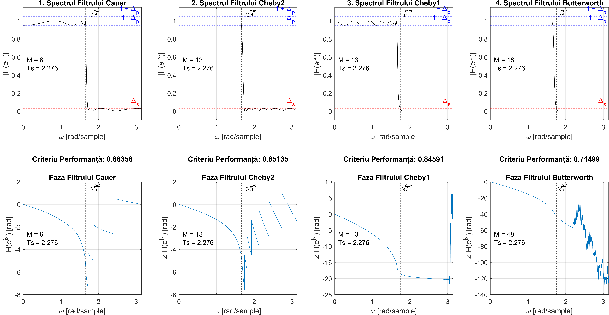

# 🎛️ IIR Filter Design via Transformation Methods

A comprehensive Digital Signal Processing (DSP) project focused on the mathematical modeling, simulation, and optimization of Infinite Impulse Response (IIR) digital filters.
Starting from continuous-time analog prototypes, the project explores their conversion into discrete-time systems and provides a deep comparative analysis against Finite Impulse Response (FIR) filters.

Developed as a university project at the Faculty of Automatic Control and Computers (UPB), aimed at studying and understanding IIR filters, as well as their design methods.

## 🛠️ Technologies & Tools

- **MATLAB** (Core programming, matrix operations, data visualization)
- **Signal Processing Toolbox** (`ellip`, `cheby1`, `cheby2`, `fir1`, `firls`)
- **Mathematical Modeling** (Z-Transform, Bilinear Transformation, Bode Analysis)
- **Algorithm Optimization** (Iterative order minimization algorithms)

## 📚 Key Features Studied

1. **Bilinear Transformations (Tustin & Pseudo-Tustin):** Implemented and analyzed the $s \to z$ domain mapping. Successfully proved, both empirically and mathematically, that the frequency response shape of the digital filter is invariant to the sampling period $T_s$ when specifications are defined in the digital domain.
2. **Comprehensive Filter Comparison:** Evaluated multiple filter families (Butterworth, Chebyshev Type I & II, Cauer/Elliptic) based on computational cost (filter order $M$), pass-band ripple, and stop-band attenuation.
3. **IIR vs. FIR Trade-offs:** Demonstrated the sheer computational efficiency of IIR filters for strict tolerances (e.g., Cauer requiring $M = 7$ vs. FIR requiring $M = 171$), highlighting that FIR is only justified when perfect linear phase is strictly necessary.
4. **Algorithmic Optimization:** Developed a custom iterative search algorithm to find the optimal cutoff frequency $\omega_c$ within the transition band $[\omega_p, \omega_s]$. This fine-tuning successfully reduced the required filter order (e.g., optimizing Chebyshev II from order 15 down to 13) without violating tolerances.
5. **Non-Unitary Gain:** Extended the classic Butterworth design by analytically deducing the new formulas for $M$ and $\omega_c$ when the DC gain is not strictly unitary ($|H(0)| = 1 + \Delta_p$), utilizing the full tolerance band to potentially lower computational complexity.

## 📊 Filter Design

As part of the project, one of the requirements was to design optimal IIR filters that meet specific performance criteria.  
The graphs below illustrate the filters I designed and optimized, showing the final solutions that strictly adhere to the frequency tolerances and performance requirements.

---

📄 Full mathematical filter analyses are available in the project documentation. All scripts and `.mat` files are included in this repository, except the ones provided by the university to generate the data.
